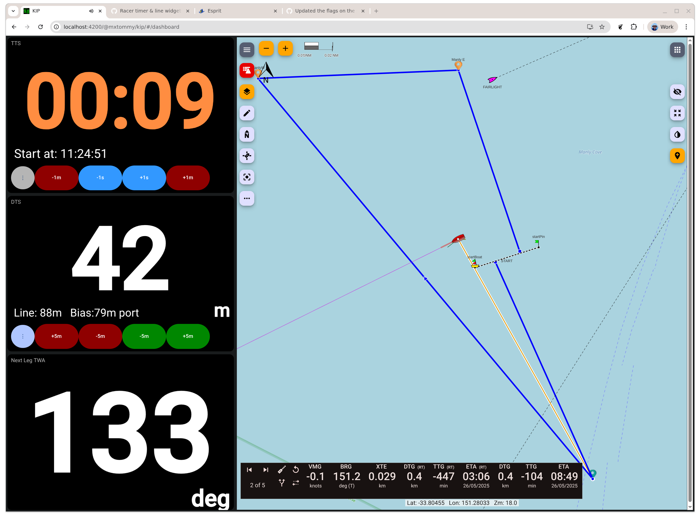

# Signal K Racing Plugin

This PROTOTYPPE plugin adds sail racing-relevant data calculations to a Signal K server. It focuses on real-time information useful during the start of a race, such as distance to the line, start line bias, and geographic position of the line ends.

GitHub repository: [https://github.com/gregw/signalk-racer](https://github.com/gregw/signalk-racer)

---

## 📌 Features

This plugin calculates and publishes the following Signal K paths:

| Path                                        | Description                                            | Units   | Schema |
|---------------------------------------------|--------------------------------------------------------|---------|--------|
| `navigation.racing.` `distanceStartline`       | Signed minimum distance from the bow to the start line | `m`     | Y      |
| `navigation.racing.` `startLineLength`         | Total length of the start line                         | `m`     |        |
| `navigation.racing.` `stbLineBias`             | Bias of the start line toward the starboard end        | `m`     |        |
| `navigation.racing.` `startLinePort.latitude`  | Latitude of the port (pin) end of the start line       | `deg`   | Y      |
| `navigation.racing.` `startLinePort.longitude` | Longitude of the port end                              | `deg`   | Y      |
| `navigation.racing.` `startLineStb.latitude`   | Latitude of the starboard (boat) end of the start line | `deg`   | Y      |
| `navigation.racing.` `startLineStb.longitude`  | Longitude of the starboard end                         | `deg`   | Y      |
| `navigation.racing.` `nextLegHeading`          | True heading for the next leg of the course            | `deg`   |        |
| `navigation.racing.` `nextLegTWA`              | True Wind Angle for the next leg of the course         | `deg`   |        |

These values can be displayed in KIP, Freeboard-SK, or other Signal K clients.

---

## ⚙️ Configuration

You can configure the plugin via the Signal K web interface or by editing `settings.json` manually.

### Parameters:

| Parameter          | Description                                                                           | Default       |
|--------------------|---------------------------------------------------------------------------------------|---------------|
| `startLineStb`     | Name of the waypoint for the starboard (committee boat) end of the line               | `"startBoat"` |
| `startLinePort`    | Name of the waypoint for the port (pin) end of the line                               | `"startPin"`  |
| `period`           | How often to update values (in milliseconds)                                          | `1000`        |

---

## 🧠 Algorithm Descriptions

### Waypoint selection (`navigation.racing.startLinePort` and `navigation.racing.startLineStb`)

The `startLineStb` and `startLinePort` configurations are used to search resources for matching waypoints. These waypoints can be modified in real time (e.g. moving or setting in Freeboard SK) and the algorithm with update to the new line.

### Bow position

If `navigation.headingTrue` is not available, then `navigation.courseOverGroundTrue` is used when determining the position of the bow relative to the GPS position.

### Distance to Start Line (`navigation.racing.distanceStartline`)

- Computes the **signed minimum distance** from the **bow** of the boat to the configured start line.
- Uses `sensors.gps.fromBow` and `sensors.gps.fromCenter` offsets to calculate the actual bow position.
- Normally uses the **perpendicular projection** from the bow to the line.
- However, if the bow is located within a **45° sector** off either end of the line, the plugin adds the distance back to that diagonal to perpendicular distance.
- The result is:
    - **Negative** when the bow is **over the line (OCS)**
    - **Positive** when the bow is **behind the line**

### Start Line Bias (`navigation.racing.stbLineBias`)

- Measures how far ahead (downwind) the **pin** end is relative to the **boat** end.
- The `environment.wind.directionTrue` is used as well as the calculated line length and bearing.
- A **positive value** means the **pin end is more downwind**, implying the **starboard (boat) end is favored** for upwind starts.

### Line Coordinates & Length

- The plugin reads Signal K `waypoints` resources for the names you configure.
- If both endpoints are found, it calculates:
- Line length (using `geolib.getPreciseDistance`)
- Line bearing (rhumb line from starboard to port)

### Next Leg
- If a course is active then the true bearing for the next leg is calculated as `navigation.racing.nextLegHeading`
- If the `environment.wind.directionTrue` is available, then the True Wind Angle for the next leg is also calculated as `navigation.racing.nextLegHeading`
- If the next mark of the active route is beyond the first mark, then the start line calculations are suspended.

---

## 🔄 Dependencies

- [geolib](https://github.com/manuelbieh/geolib): Used for all geospatial math, including distances, bearings, and projections.

---

## 🧪 Future Plans

- Add calculations for:
- **Time to line** (using STW and heading or polar speeds)
- **Laylines** and distance/time to them
- Include webapp UI for on-deck ease of "pinging" the line
- Better integration with **Freeboard-SK** and **KIP** dashboards

---

## 📬 Feedback

Bug reports and suggestions are welcome at  
[https://github.com/gregw/signalk-racer](https://github.com/gregw/signalk-racer)