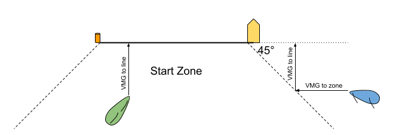

# Signal K Racing Plugin

This plugin adds sail racing relevant data to a Signal K server. It focuses on real-time information useful during the start of a race, such as:
 + A server side race timer that can be displayed on multiple screens and be finely adjusted
 + A mechanism to set and adjust the start line using waypoints and REST commands
 + Calculation of the distance to the line.
 + Calculation of the TWA for the next leg of the course.

GitHub repository: [https://github.com/gregw/signalk-racer](https://github.com/gregw/signalk-racer)

---

## 📌 Features

This plugin calculates and publishes the following Signal K paths:

| Path                                            | Description                                            | Units                  | Std |
|-------------------------------------------------|--------------------------------------------------------|------------------------|-----|
| `navigation.racing.`<br/>`distanceStartline`    | Signed minimum distance from the bow to the start line | `m`                    | Y   |
| `navigation.racing.`<br/>`startLineLength`      | Total length of the start line                         | `m`                    |     |
| `navigation.racing.`<br/>`stbLineBias`          | Bias of the start line toward the starboard end        | `m`                    |     |
| `navigation.racing.`<br/>`startLinePort`        | Location of the port (pin) end of the start line       | `{latitude,longitude}` | Y   |
| `navigation.racing.`<br/>`startLineStb`         | Location of the starboard (boat) end of the start line | `{latitude,longitude}` | Y   |
| `navigation.racing.`<br/>`nextLegHeading`       | True heading for the next leg of the course            | `rad`                  |     |
| `navigation.racing.`<br/>`nextLegTrueWindAngle` | True Wind Angle for the next leg of the course         | `rad`                  |     |
| `navigation.racing.`<br/>`timeToStart`          | Period of time until the race start                    | `s`                    | Y   |
| `navigation.racing.`<br/>`timeToLine`           | Period of time to sail to the line at best VMG         | `s`                    |     |
| `navigation.racing.`<br/>`timeToBurn`           | Period of time delay before sailing to the at best VMG | `s`                    |     |
| `navigation.racing.`<br/>`startTime`            | The start time as an ISO timestamp                     | `rfc3339`              |     |

These values can be displayed in KIP widgets, Freeboard-SK, or other Signal K clients.  
There are dedicated widgets for the start timer and line adjustment since 3.5.0 of KIP 


There is also a webapp to adjust the line and timer.


---

## ⚙️ Configuration

You can configure the plugin via the Signal K web interface or by editing `settings.json` manually.

### Parameters:

| Parameter                 | Description                                                             | Default       |
|---------------------------|-------------------------------------------------------------------------|---------------|
| `startLineStb`            | Name of the waypoint for the starboard (committee boat) end of the line | `"startBoat"` |
| `startLinePort`           | Name of the waypoint for the port (pin) end of the line                 | `"startPin"`  |
| `timer`                   | Initial time for the race timer (in seconds)                            | `300`         |
| `period`                  | How often to update values (in milliseconds)                            | `1000`        |
| `updateStartLineWaypoint` | Should the waypoints be updated if the line is set/adjusted             | `true`        |
| `createStartLineWaypoint` | Should the waypoints be created if the line is set                      | `true`        |
| `lines`                   | Array of named lines                                                    | null          |

---

## 🧠 Algorithm Descriptions

### Waypoint selection (`navigation.racing.startLinePort` and `navigation.racing.startLineStb`)

The `startLineStb` and `startLinePort` configurations are used to search resources for matching waypoints. These waypoints can be modified in real time (e.g. moving or setting in Freeboard SK) and the algorithm with update to the new line.

### Bow position

If `navigation.headingTrue` is not available, then `navigation.courseOverGroundTrue` is used when determining the position of the bow relative to the GPS position.

### Distance to Start Line (`navigation.racing.distanceStartline`)



- Computes the distance from the **bow** of the boat to the configured start line.  
- For boats within the start zone (defined as with a 45 degree bearing to each end of the line), the perpendicular distance to the line is used.
- For boats outside of the start zone, the distance parallel to the line to reach the zone is added to their perpendicular distance to the line.
- Uses `sensors.gps.fromBow` and `sensors.gps.fromCenter` offsets to calculate the actual bow position.
- The result is:
    - **Negative** when the bow is **over the line (OCS)**
    - **Positive** when the bow is **behind the line**
- If the boat is navigating a route and the next waypoint is beyond the second in the route, then the distance to line is not calculated.

### Start Line Bias (`navigation.racing.stbLineBias`)

- Measures how far ahead (downwind) the **pin** end is relative to the **boat** end.
- The `environment.wind.directionTrue` is used as well as the calculated line length and bearing.
- A **positive value** means the **pin end is more downwind**, implying the **starboard (boat) end is favored** for upwind starts.

### Time To Line (`navigation.racing.timeToLine`)

 - Uses the effective VMG as the maximum VMG of either the current COG/SOG or the 90th percentile of the VMG recently achieved (approx in the last 10 minutes).
   This allows a boat to luff / delay without changing the time to line.
 - A boat within the start zone has the time calculated by the perpendicular distance to the line divided by their effective VMG to the line.
 - A boat outside the start zone also has the perpendicular time plus the time calculated by the parallel distance to the zone divided by their effective VMG in that direction.
 - If the line is changed, then the samples used to calculate the effective VMGs are cleared.
 - If the boat is navigating a route and the next waypoint is beyond the second in the route, then the time to line is not calculated.


### Time To Burn (`navigation.racing.timeToBurn`)
 - If the start timer is running and the boat is not OCS, then the time to burn is calculated by subtracting the time to line from the remaining start time. 
 - If the boat is navigating a route and the next waypoint is beyond the second in the route, then the time to line is not calculated.

### Line Coordinates & Length

- The plugin reads Signal K `waypoints` resources for the names you configure.
- If both endpoints are found, it calculates:
- Line length (using `geolib.getPreciseDistance`)
- Line bearing (rhumb line from starboard to port)

### Next Leg
- If a course is active then the true bearing for the next leg is calculated as `navigation.racing.nextLegHeading`
- If the `environment.wind.directionTrue` is available, then the True Wind Angle for the next leg is also calculated as `navigation.racing.nextLegTrueWindAngle`
- If the next mark of the active route is beyond the first mark, then the start line calculations are suspended.

---

## 🌐 API Access

This plugin uses the following WebSocket-based PUT requests to Signal K model paths.

### `navigation.racing.setStartLine`

Used to **set** or **adjust** either end of the start line.

#### Payload:
```
{
  "end": "port" | "stb",             
  "position": "bow" | { "latitude": ..., "longitude": ... },  
  "delta": 10,                       
  "rotate": 0.1                      
}
```

- `end`: which end to modify.
- `position`: `"bow"` or `{ latitude, longitude }`.
- `delta`: distance in meters along bearing.
- `rotate`: angle in radians.

---

### `navigation.racing.setStartTime`

Used to **start**, **sync**, **reset**, or **set a fixed start time**.

#### Payload:
```
{
  "command": "start" | "reset" | "sync" | "adjust" | "set",
  "delta": 30,
  "startTime": "2025-06-18T04:15:00Z"
}
```
---

## 🧩 KIP Widgets
KIP components for `racer-timer` and `racer-line` have been developed and are available from release 3.5.0 of KIP.

## 🔄 Dependencies

### Plugins
- [KIP >= 3.5.0](https://github.com/mxtommy/Kip) for graphic widget support
- [FreeboardSK](https://github.com/SignalK/freeboard-sk#readme) for graphic display of the start line
- [resources-provider](https://www.npmjs.com/package/@signalk/resources-provider) plugin with waypoints enabled
- [course-provider](https://www.npmjs.com/package/@signalk/course-provider) plugin to enable the next leg calculations

### Libraries
- `geolib`: for distance and bearing calculations.

---

## 🧪 Future Plans

- Add calculations for:
- **Time to burn**
- **Laylines** and distance/time to them

--- 
## 📬 Feedback

Bug reports and suggestions are welcome at  
[https://github.com/gregw/signalk-racer](https://github.com/gregw/signalk-racer)


---
## Development
```text
npm install
npm link
cd ~/.signalk
npm link signalk-racer
```