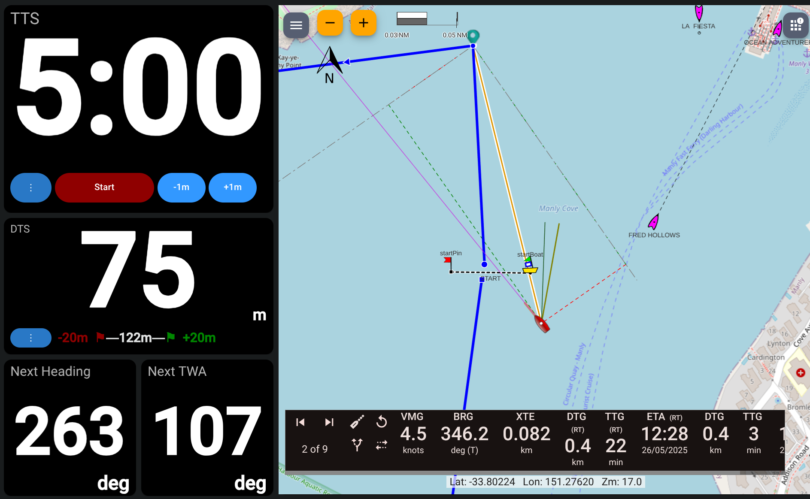
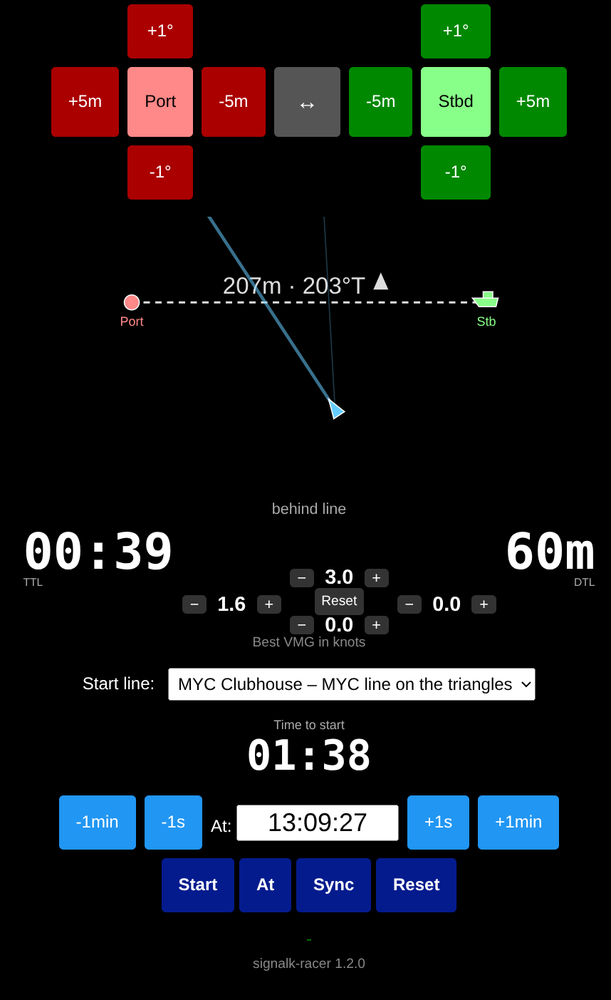
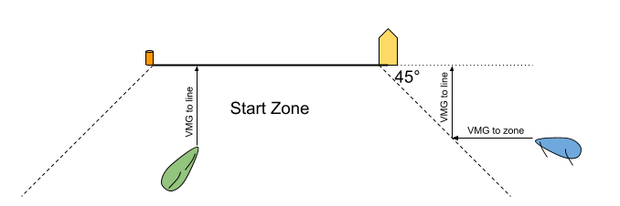

# Signal K Racing Plugin

This plugin adds sail racing relevant data to a Signal K server. It focuses on real-time information useful during the start of a race, such as:
 + A server side race timer that can be displayed on multiple screens and be finely adjusted
 + A mechanism to set and adjust the start line using waypoints and REST commands
 + Calculation of the distance to the line.
 + Calculation of the TWA for the next leg of the course.

GitHub repository: [https://github.com/gregw/signalk-racer](https://github.com/gregw/signalk-racer)

---

## 📌 Features

This plugin calculates and publishes the following Signal K paths:

| Path                                       | Description                                                            | Units                                              | Std |
|--------------------------------------------|------------------------------------------------------------------------|----------------------------------------------------|-----|
| `navigation.racing.distanceStartline`      | Signed minimum distance from the bow to the start line                 | `m`                                                | Y   |
| `navigation.racing.startLineLength`        | Total length of the start line                                         | `m`                                                |     |
| `navigation.racing.startLineBearing`       | Bearing of the start line, from the stb end to the port end            | `rad`                                              |     |
| `navigation.racing.stbLineBias`            | Bias of the start line toward the starboard end                        | `m`                                                |     |
| `navigation.racing.bestVmg.toCourseSide`   | Best VMG across the line towards the course side                       | `m/s`                                              |     |
| `navigation.racing.bestVmg.fromCourseSide` | Best VMG back across the line from the course side (used when OCS)     | `m/s`                                              |     |
| `navigation.racing.bestVmg.toPortEnd`      | Best VMG along the line towards the port end (pin)                     | `m/s`                                              |     |
| `navigation.racing.bestVmg.toStbEnd`       | Best VMG along the line towards the stb end (boat)                     | `m/s`                                              |     |
| `navigation.racing.bestVmg.*.override`     | The manual adjustment behind each best VMG, `null` when not adjusted   | `m/s`                                              |     |
| `navigation.racing.effectiveVmg.toLine`    | VMG the perpendicular leg of the time to line is divided by            | `m/s`                                              |     |
| `navigation.racing.effectiveVmg.alongLine` | VMG the along-line leg is divided by, 0 when inside the start zone     | `m/s`                                              |     |
| `navigation.racing.bestApproach`           | The course actually sailed that achieved the best VMG towards the line | `{rad,m/s}`                                        |     |
| `navigation.racing.startLinePort`          | Location of the port (pin) end of the start line                       | `{latitude,longitude}`                             | Y   |
| `navigation.racing.startLineStb`           | Location of the starboard (boat) end of the start line                 | `{latitude,longitude}`                             | Y   |
| `navigation.racing.nextLegHeading`         | True heading for the next leg of the course                            | `rad`                                              |     |
| `navigation.racing.nextLegTrueWindAngle`   | True Wind Angle for the next leg of the course                         | `rad`                                              |     |
| `navigation.racing.timeToStart`            | Period of time until the race start                                    | `s`                                                | Y   |
| `navigation.racing.timeToLine`             | Period of time to sail to the line at best VMG                         | `s`                                                |     |
| `navigation.racing.timeToBurn`             | Period of time delay before sailing to the at best VMG                 | `s`                                                |     |
| `navigation.racing.startTime`              | The start time as an ISO timestamp                                     | `rfc3339`                                          |     |

These values can be displayed in KIP widgets, Freeboard-SK, or other Signal K clients.  
There are dedicated widgets for the start timer and line adjustment since 3.5.0 of KIP 



There is also a webapp to: adjust the line, visualize the approach to the line, adjust VMGs and configure the timer.



---

## ⚙️ Configuration

You can configure the plugin via the Signal K web interface or by editing `settings.json` manually.

### Parameters:

| Parameter                 | Description                                                             | Default       |
|---------------------------|-------------------------------------------------------------------------|---------------|
| `startLineStb`            | Name of the waypoint for the starboard (committee boat) end of the line | `"startBoat"` |
| `startLinePort`           | Name of the waypoint for the port (pin) end of the line                 | `"startPin"`  |
| `timer`                   | Initial time for the race timer (in seconds)                            | `300`         |
| `period`                  | How often to update values (in milliseconds)                            | `1000`        |
| `updateStartLineWaypoint` | Should the waypoints be updated if the line is set/adjusted             | `true`        |
| `createStartLineWaypoint` | Should the waypoints be created if the line is set                      | `true`        |
| `minEffectiveVmg`         | Floor under each effective VMG used for time to line (in knots)         | `0.5`         |
| `lines`                   | Array of named lines                                                    | null          |

---

## 🧠 Algorithm Descriptions

### Waypoint selection (`navigation.racing.startLinePort` and `navigation.racing.startLineStb`)

The `startLineStb` and `startLinePort` configurations are used to search resources for matching waypoints. These waypoints can be modified in real time (e.g. moving or setting in Freeboard SK) and the algorithm with update to the new line.

### Bow position

If `navigation.headingTrue` is not available, then `navigation.courseOverGroundTrue` is used when determining the position of the bow relative to the GPS position.

### Distance to Start Line (`navigation.racing.distanceStartline`)



- Computes the distance from the **bow** of the boat to the configured start line.  
- For boats within the start zone (defined as with a 45 degree bearing to each end of the line), the perpendicular distance to the line is used.
- For boats outside of the start zone, the distance parallel to the line to reach the zone is added to their perpendicular distance to the line.
- Uses `sensors.gps.fromBow` and `sensors.gps.fromCenter` offsets to calculate the actual bow position.
- The result is:
    - **Negative** when the bow is **over the line (OCS)**
    - **Positive** when the bow is **behind the line**
- If the boat is navigating a route and the next waypoint is beyond the second in the route, then the distance to line is not calculated.

### Start Line Bias (`navigation.racing.stbLineBias`)

- Measures how far ahead (downwind) the **pin** end is relative to the **boat** end.
- The `environment.wind.directionTrue` is used as well as the calculated line length and bearing.
- A **positive value** means the **pin end is more downwind**, implying the **starboard (boat) end is favored** for upwind starts.

### Time To Line (`navigation.racing.timeToLine`)

 - Uses the effective VMG as the maximum VMG of either the current COG/SOG or the 90th percentile of the VMG recently achieved (approx in the last 10 minutes).
   This allows a boat to luff / delay without changing the time to line.
 - Each effective VMG is floored at `minEffectiveVmg` (default 0.5 knots), so a direction
   with nothing collected yet - or a drifting boat - still yields a time rather than none.
   The floor is not applied to the along-line leg when the boat is inside the start zone,
   there being no such leg to sail.
 - A boat within the start zone has the time calculated by the perpendicular distance to the line divided by their effective VMG to the line.
 - A boat outside the start zone also has the perpendicular time plus the time calculated by the parallel distance to the zone divided by their effective VMG in that direction.
 - If the line is changed, then the samples used to calculate the effective VMGs are cleared.
 - Every sample keeps the `cog` and `sog` that produced it, so the course behind the 90th
   percentile VMG towards the line can be recovered and is published as
   `navigation.racing.bestApproach`. The direction is chosen exactly as the time to line
   chooses its legs, and is reported alongside the course:
     - Inside the start zone the line is closed across it, so `toCourseSide` is used, or
       `fromCourseSide` when OCS.
     - Outside the start zone the boat must first run along the line, so the along-line
       samples are used, in the direction *away* from the closest end: beyond the pin it
       must travel towards the starboard end, so `toStbEnd` governs, and vice versa.
 - The four collected VMGs are published under `navigation.racing.bestVmg.*` and may be manually
   adjusted. An adjustment stands in for the 90th percentile of the samples, but the VMG the boat
   is actually sailing still wins if it is better, so an adjustment can never make the estimate
   ignore real progress. Adjustments are cleared when the start timer reaches zero, when the line
   changes, and by the `reset` command.
 - If the boat is navigating a route and the next waypoint is beyond the second in the route, then the time to line is not calculated.


### Time To Burn (`navigation.racing.timeToBurn`)
 - If the start timer is running and the boat is not OCS, then the time to burn is calculated by subtracting the time to line from the remaining start time. 
 - If the boat is navigating a route and the next waypoint is beyond the second in the route, then the time to line is not calculated.

### Line Coordinates & Length

- The plugin reads Signal K `waypoints` resources for the names you configure.
- If both endpoints are found, it calculates:
- Line length (using `geolib.getPreciseDistance`)
- Line bearing (rhumb line from starboard to port)

### Next Leg
- If a course is active then the true bearing for the next leg is calculated as `navigation.racing.nextLegHeading`
- If the `environment.wind.directionTrue` is available, then the True Wind Angle for the next leg is also calculated as `navigation.racing.nextLegTrueWindAngle`
- If the next mark of the active route is beyond the first mark, then the start line calculations are suspended.

---

## 📉 Webapp Start Line Visualization

The webapp draws the line "line up": always horizontal, with the **port (pin) end to the left**
and the **starboard (committee boat) end to the right**. The course side of the line is therefore
always the **upper** half of the drawing and the pre-start side the lower half, so the arrow beside
the line length and start heading always points straight up. The drawing is auto-scaled to fit the
line and the boat, so it zooms as the boat closes. The line length and the heading to sail to cross
the line are marked on the line itself, and the boat is drawn as a triangle pointing along its
heading, amber when OCS.

Two projections run from the boat. Both start at the boat and are drawn to the same scale as the
rest of the drawing, so their **tips can be read directly against the line**. Hovering the boat
reports its SOG and COG and names whichever of the two lines are currently drawn.

#### Thick line — "Current cog/sog to start"

Runs along the boat's present `navigation.courseOverGroundTrue`. While the start timer is counting
down, its length is `SOG × timeToStart`: the distance the boat will cover before the gun if nothing
changes. Its tip is therefore **where the boat will be when the start fires**:

- tip short of the line — the boat is late and will cross after the gun
- tip on the line — a perfect start
- tip beyond the line — the boat is early and will be OCS

With no timer running there is nothing to project against, so it degrades to a short fixed-length
stub showing course only.

#### Thin faint line — "Best VMG to start"

Runs along `navigation.racing.bestApproach`, with its length that course's own
`SOG × timeToStart`. This is **not** a synthetic best case: it is a course the boat has genuinely
sailed in the last few minutes, being the `cog`/`sog` recorded against the 90th percentile VMG
sample for the direction that actually matters (across the line, or along it when outside the start
zone — see [Time To Line](#time-to-line-navigationracingtimetoline)). Because it is a real point of
sail it runs on its **own bearing**, not the current one, so it will diverge from the thick line
whenever the boat is not sailing as well as it recently has.

Comparing the two tips is the point of the pair: if the thin line reaches the line and the thick one
falls short, then sailing the boat as well as it has already been sailed would get you there, and
the difference between the tips is what is being left on the table. If no samples have been
collected yet, or the timer is not running, this line is not drawn.

Over a long countdown both projections run well off the drawing and are simply clipped at its edge;
the part that matters — where they cross the line — stays visible.

---

## 🌐 API Access

This plugin uses the following WebSocket-based PUT requests to Signal K model paths.

### `navigation.racing.setStartLine`

Used to **set** or **adjust** either end of the start line.

#### Payload:
```
{
  "end": "port" | "stb",             
  "position": "bow" | { "latitude": ..., "longitude": ... },  
  "delta": 10,                       
  "rotate": 0.1                      
}
```

- `end`: which end to modify.
- `position`: `"bow"` or `{ latitude, longitude }`.
- `delta`: distance in meters along bearing.
- `rotate`: angle in radians.

---

### `navigation.racing.swapStartLine`

Used to **swap** the port (pin) and starboard (boat) ends of the line, reversing its bearing.
Takes no parameters. Collected VMG samples and any manual adjustments are exchanged along
with the ends rather than discarded, since reversing the bearing flips the sign of both VMG
components and so leaves every sample valid, just relabelled.

---

### `navigation.racing.setBestVmg`

Used to **adjust** or **reset** the best VMGs used to estimate the time to line.

#### Payload:
```
{
  "vmg": "toCourseSide" | "fromCourseSide" | "toPortEnd" | "toStbEnd",
  "value": 5.0,
  "delta": 0.0514,
  "command": "reset" | "clear"
}
```

- `vmg`: which best VMG to adjust. Optional for `reset`, which otherwise clears all four.
- `value`: absolute best VMG in `m/s`.
- `delta`: adjustment in `m/s` applied to the current best VMG.
- `command`: `"reset"` to clear the override and revert to the collected samples, or
  `"clear"` to throw away the collected samples themselves and start again.

An absolute value may also be put directly to `navigation.racing.bestVmg.<name>`.

---

### `navigation.racing.setStartTime`

Used to **start**, **sync**, **reset**, or **set a fixed start time**.

#### Payload:
```
{
  "command": "start" | "reset" | "sync" | "adjust" | "set",
  "delta": 30,
  "startTime": "2025-06-18T04:15:00Z"
}
```
---

## 🧩 KIP Widgets
KIP components for `racer-timer` and `racer-line` have been developed and are available from release 3.5.0 of KIP.

## 🔄 Dependencies

### Plugins
- [KIP >= 3.5.0](https://github.com/mxtommy/Kip) for graphic widget support
- [FreeboardSK](https://github.com/SignalK/freeboard-sk#readme) for graphic display of the start line
- [resources-provider](https://www.npmjs.com/package/@signalk/resources-provider) plugin with waypoints enabled
- [course-provider](https://www.npmjs.com/package/@signalk/course-provider) plugin to enable the next leg calculations

### Libraries
- `geolib`: for distance and bearing calculations.

---

## 🧪 Future Plans

- Add calculations for:
- **Time to burn**
- **Laylines** and distance/time to them

--- 
## 📬 Feedback

Bug reports and suggestions are welcome at  
[https://github.com/gregw/signalk-racer](https://github.com/gregw/signalk-racer)


---
## Development

### Linking the plugin into a local server

```text
npm install
npm link
cd ~/.signalk
npm link signalk-racer
```

This replaces `~/.signalk/node_modules/signalk-racer` with a symlink to your checkout, so
edits take effect on the next server restart with no reinstall. Verify the link with:

```text
readlink -f ~/.signalk/node_modules/signalk-racer
```

> ⚠️ **The link is fragile.** `~/.signalk/package.json` still lists `signalk-racer` as a
> normal dependency, so running `npm install` (or installing/updating *any* plugin from the
> server's Appstore) will overwrite the symlink with the published release from npm, silently
> reverting you to the registry version. Re-run `npm link signalk-racer` in `~/.signalk`
> whenever that happens.

### Checking which build is actually running

The plugin stamps its version in three places, so a stale link is easy to spot:

- the **Plugin Config** page in the admin UI, as the plugin status `signalk-racer <version> started`
- the bottom of the **racer webapp**
- the server log, via `app.debug`, including the directory it was loaded from

During development the version carries a `-dev.N` suffix (e.g. `1.2.0-dev.0`), so it is
immediately distinguishable from a released version installed from npm.

A restart is required for any change to plugin code — the server does not hot-reload plugins.
Changes to files under `public/` are served statically, so those only need a browser reload
(with cache bypass: `Ctrl+Shift+R`).

### Running the server on this machine

The server is installed **globally** (`npm root -g` → `/usr/lib/node_modules`) and runs as a
system service, using `~/.signalk` as its config directory:

```text
sudo systemctl status signalk       # is it running?
sudo systemctl restart signalk      # pick up plugin changes
journalctl -u signalk -f            # follow the log
```

### Updating signalk-server

Because it is installed into a system directory, updating needs `sudo`, and the service must be
restarted afterwards:

```text
npm view signalk-server version                 # latest published
npm ls -g --depth=0 signalk-server              # currently installed
sudo npm install -g signalk-server              # update to latest
sudo systemctl restart signalk
```

To pin a specific version instead, use `sudo npm install -g signalk-server@2.31.1`.

Note that `~/.signalk/package.json` also lists `signalk-server` as a dependency; that entry is
only bookkeeping for the Appstore and is **not** what the service runs — the globally installed
copy in `/usr/lib/node_modules/signalk-server` is. Updating the global copy is what counts.

---
## 🚀 Releasing

Releases are cut manually from a clean `main` checkout and published to npm.

### Pre-flight

1. Confirm `main` is up to date and clean: `git checkout main && git pull && git status`.
2. Run the test suite: `npm test`.
3. Review commits since the last release: `git log $(git describe --tags --abbrev=0)..HEAD --oneline`.
4. Decide the version bump (semver): `patch` for bug fixes, `minor` for features, `major` for breaking changes.

### Cut the release

1. Update `ReleaseNotes.md` — add a new entry at the top with the new version and a short bullet list of changes, then `git add ReleaseNotes.md`.
2. Bump the version and create the git tag in one step (note the non-default tag prefix so it matches the existing `signalk-racer-X.Y.Z` convention):
   ```
   npm version <patch|minor|major> --tag-version-prefix=signalk-racer-
   ```
   This rewrites `package.json`, includes any staged files (e.g. `ReleaseNotes.md`) in the bump commit, and creates tag `signalk-racer-X.Y.Z`.
3. Push the commit and the tag:
   ```
   git push origin main
   git push origin signalk-racer-X.Y.Z
   ```

### Publish to npm

1. Confirm npm auth: `npm whoami` (login with `npm login` if needed).
2. Dry-run the publish to inspect the tarball contents: `npm publish --dry-run`.
3. Publish: `npm publish` (the package is public and unscoped; no `--access` flag needed).

### After release

1. Verify on npm: `npm view signalk-racer version` should report the new version.
2. (Optional) Create a GitHub release from the new tag with notes copied from `ReleaseNotes.md`.